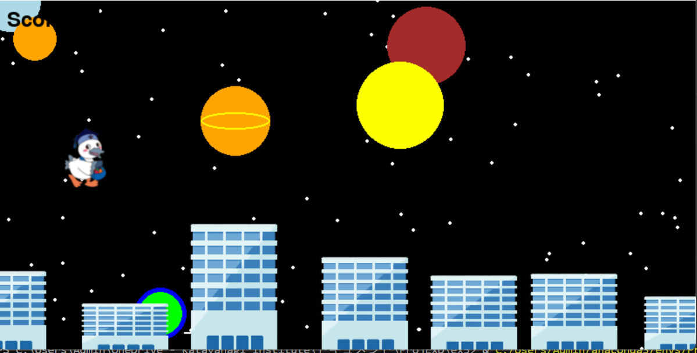

# こうかとん走

## 実行環境の必要条件
* python >= 3.10
* pygame >= 2.1

## ゲームの概要
* こうかとんが障害物や落とし穴に気を付けて走破目指すゲーム

## ゲームの遊び方
* スペースキーを押してこうかとんをジャンプさせて障害物をよけたり、落とし穴を避ける
* 敵を倒してスコアが加算される
* アイテムを散らしてそれを拾って性能を向上させる

## ゲームの実装
### 共通基本機能
* 背景画像
* 障害物
* 走る物体の動き

### 分担追加機能
* スタート画面＋こうかとん画像＋ゲーム中の音楽の挿入（担当：奥野）：特定のボタンを押すことでゲームがスタートする機能
* アイテム（担当：市川）：こうかとんがアイテムを取得すると特定のパワーアップがされる機能
* スコアリゾルト（担当：松橋）：こうかとんが走った分のスコア加算と表示機能
* 障害物（担当：東）：こうかとんが避けたりする障害物を表示する機能
* 背景（担当：大岡）：背景画像に流れ星を追加する機能
• 

### ToDo
- [ ] 各機能に合わせてコードを作成
- [ ] 各自追加したい機能があったら追加して随時報告

### メモ
* 
